# 🚀 Professional Task Management System
A full-stack Task Management application built with **FastAPI** (Backend) and **React** (Frontend), featuring secure JWT authentication and full CRUD capabilities.

## 🌐 Live Links
- **Frontend (Live):** [Vercel URL]
- **Backend (API Docs):** [Render URL]/docs

## ✨ Features
- **Secure Auth**: 
Full Login and Registration system using password hashing (Bcrypt) and token-based sessions.

Tasks are strictly linked to the account holder. A user can only view, edit, or delete their own tasks.

Protected API endpoints that require a valid JWT Bearer Token.

- **Task CRUD**: 
Create, read, update, and delete tasks with ease.
- **Smart Filtering**: 
Filter tasks by status (Completed/Pending).
- **Pagination**: 
Efficiently handle large lists of tasks.
- **Responsive UI**: 
Glassmorphism design that works on mobile and desktop.
### 📸 App Walkthrough
<details>
  <summary>Click to view screenshots</summary>

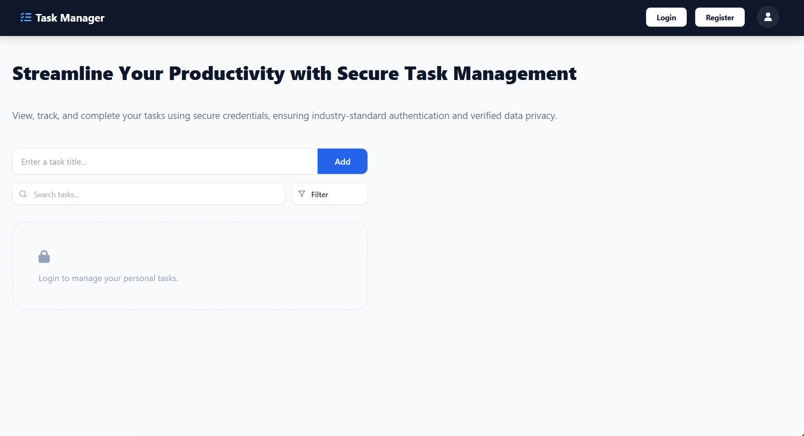
*A clean, modern entry point prompting users to authenticate to manage their private tasks.*

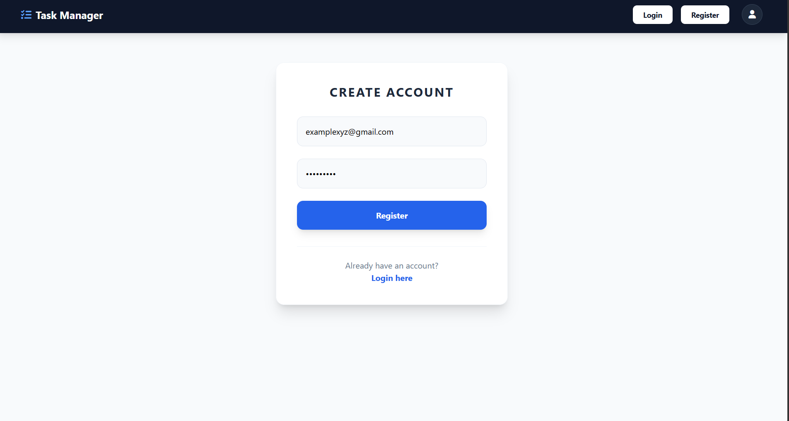
*Secure account creation with validated credentials and a sleek, centered UI.*

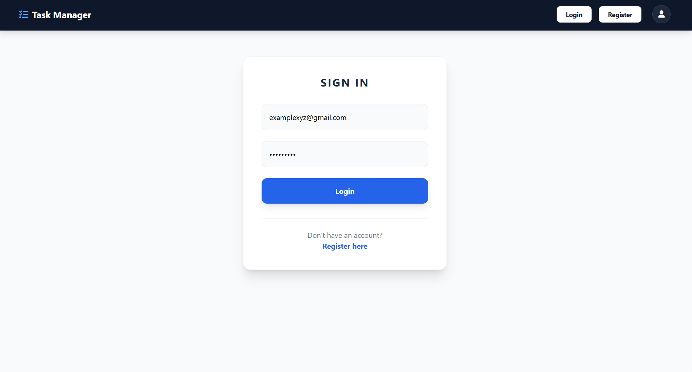
*JWT-based authentication ensuring data privacy and individual task isolation.*

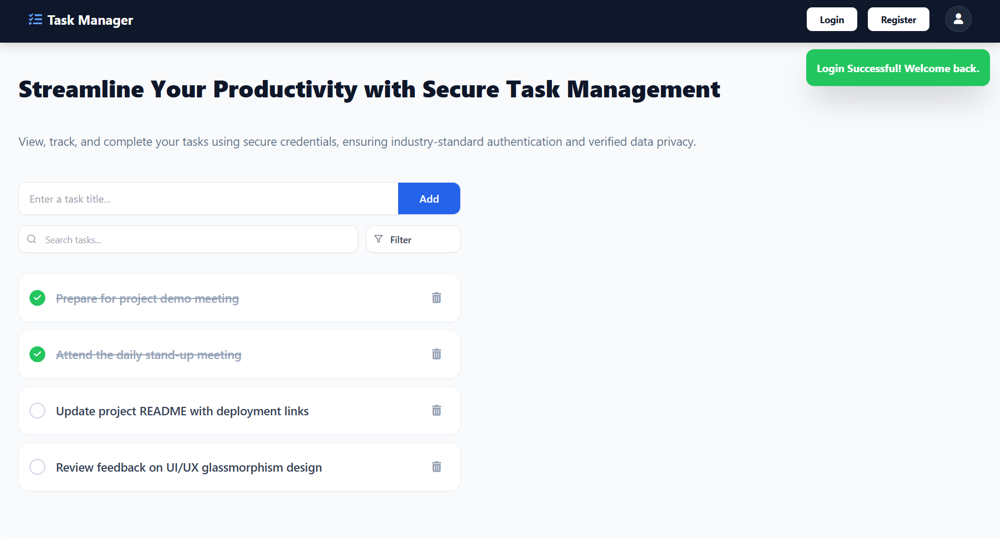
*Successful login leads to a customized workspace with instant success notifications.*

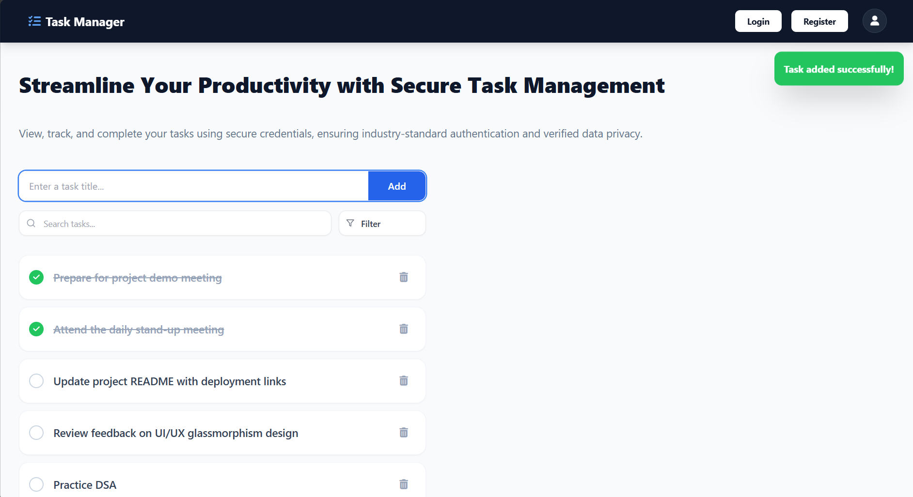
*Effortlessly add new tasks with real-time feedback and automatic list updating.*

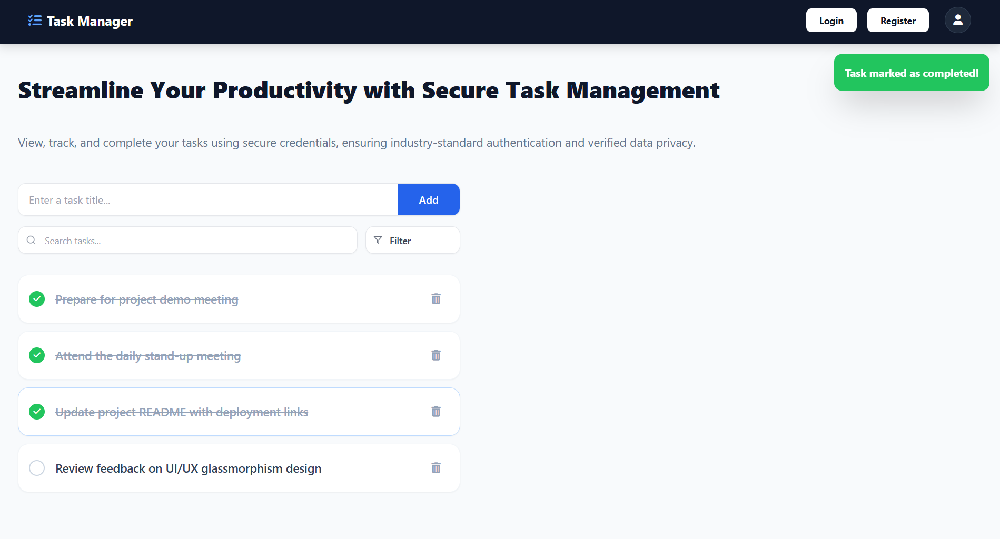
*Easily toggle task status with immediate visual cues and success alerts.*

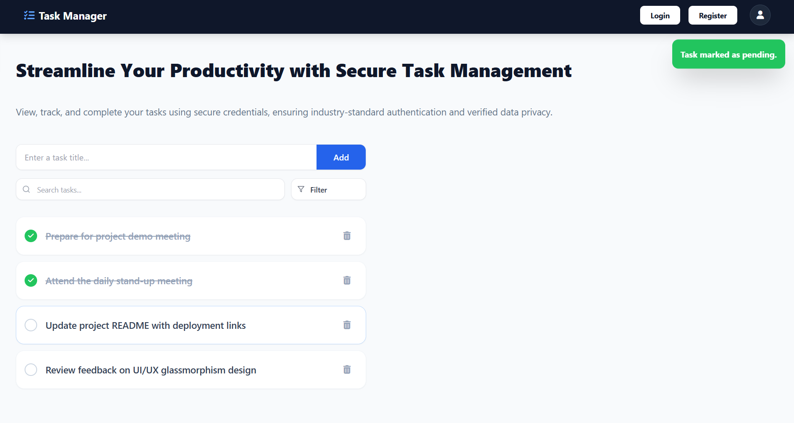
*Ability to revert task status back to pending for accurate workflow tracking.*

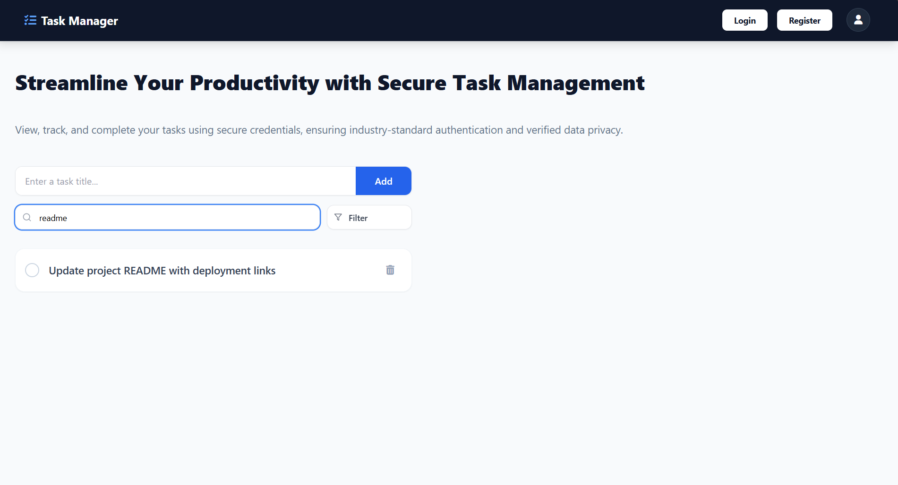
*Real-time task filtering as you type, allowing users to quickly locate specific entries within a large list.*

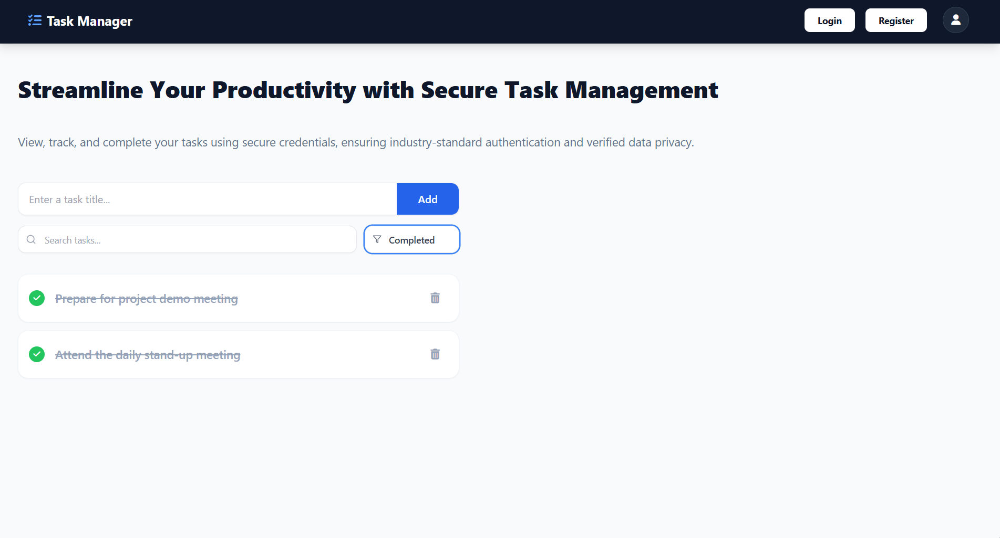
*Focused view showing only finished objectives via the interactive filter.*

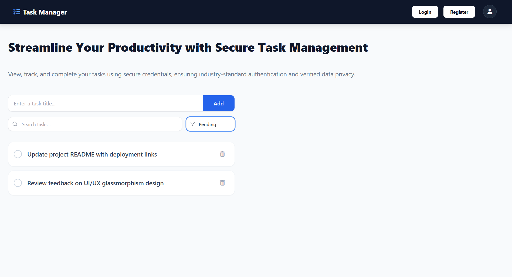
*Streamlined view of remaining work to help prioritize current goals.*

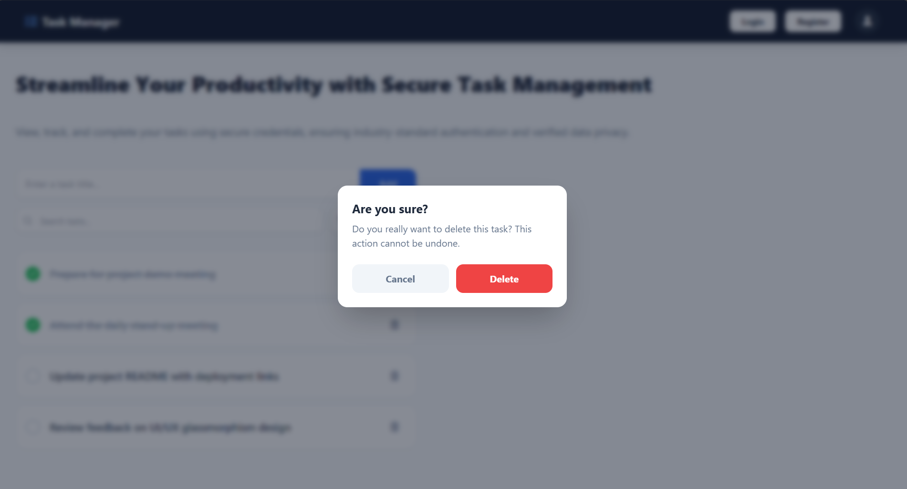
*Safety-first approach with a confirmation modal to prevent accidental task loss.*

</details>


## 🛠️ Tech Stack
- **Frontend**: React.js, Tailwind CSS, Axios.
- **Backend**: FastAPI (Python 3.11), SQLAlchemy, Pydantic.
- **Database**: SQLite (Development) / PostgreSQL (Production).
- **Deployment**: Vercel (Frontend), Render (Backend).

## 🚀 Local Setup
1. **Clone the repo**: `git clone <your-repo-link>`
2. **Backend Setup**:
   - `cd backend`
   - `pip install -r requirements.txt`
   - Create a `.env` file based on `.env.example`.
   - `uvicorn app.main:app --reload`
3. **Frontend Setup**:
   - `cd frontend`
   - `npm install`
   - `npm start`

### 🔑 Environment Variables
To run this project, you will need to add the following environment variables to your `.env` file:

**Backend:**
- `DATABASE_URL`: Your SQLite or PostgreSQL connection string.
- `SECRET_KEY`: A random string for JWT signing.
- `ALGORITHM`: Usually `HS256`.
- `ACCESS_TOKEN_EXPIRE_MINUTES`: e.g., `30`.

**Frontend:**
- `REACT_APP_API_URL`: The URL of your deployed backend.

## 📖 API Documentation
Once the backend is running, you can access the interactive API documentation at:
- **Swagger UI**: `http://localhost:8000/docs`
- **ReDoc**: `http://localhost:8000/redoc`

*Note: These are also available on the live backend link provided above.*

## 🐳 Docker Support
Run the backend using Docker:
```bash
docker build -t task-backend ./backend
docker run -p 8000:8000 task-backend
```

## 🧪 Running Tests
This project includes a comprehensive suite of tests using **Pytest** to ensure API reliability and security.

To run the tests:
1. Navigate to the backend: `cd backend`
2. Run pytest: `pytest`

**Key Tests Included:**
- User Registration & Authentication (JWT)
- Task Creation & Ownership Logic
- Pagination and Filter functionality
